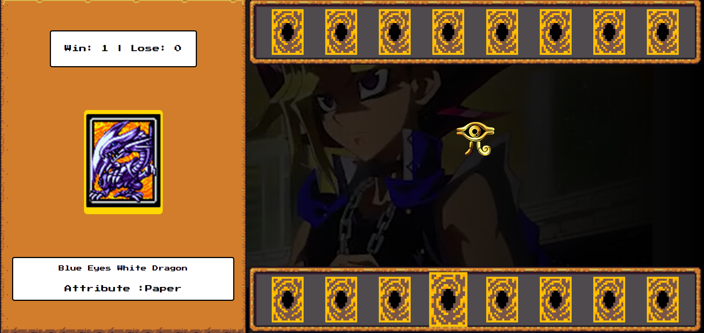

# Yu-Gi-Oh | Jo-ken-po Edition

  

Bem-vindo ao **JSGame Yu-Gi-Oh Jokenpo**! Neste repositório, você encontrará um jogo divertido de cartas jokenpo com o tema Yu-Gi-Oh". Este projeto não apenas oferece entretenimento, mas também proporciona o aprendizado de lógica de programação, Armazenamento e gerenciamento de estado manual, funções simples e organização de código.
### Créditos

Este jogo foi desenvolvido no desafio "Criando um Jogo de Cartas do Yu-Gi-Oh! com JavaScript e CSS" no BootCamp Potência Tech iFood - Desenvolvimento de Jogos da DIO. 
---

### Tecnologias Utilizadas

- HTML5 e CSS3 para a estrutura e aparência do jogo.
- JavaScript para a lógica de programação e interatividade.
- Imagens customizadas para criar a estética do universo Yu-Gi-Oh.

### Funcionalidades Incríveis

- **Sistema de Pontuação**: Acompanhe sua pontuação à medida que progride no jogo e desafie seus amigos a superá-la. 
